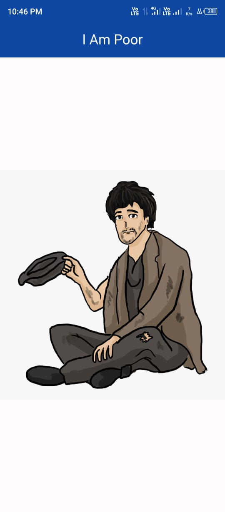

# I Am Poor App

This is a simple Flutter application called "I Am Poor". It is a minimalist app that demonstrates the basics of Flutter app development, focusing on UI design and layout.

## Description

The "I Am Poor" app is the opposite of the famous "I Am Rich" app. It consists of a single screen that displays an image of a coal or a rock along with the text "I Am Poor". It serves as a fun and educational project for beginners learning Flutter development.

## Features

- Displays an image of a poor man.
- Displays the text "I Am Poor".

## Screenshots

## Usage

1. Clone or download the repository.
2. Open the project in Android Studio or any other Flutter-compatible IDE.
3. Run the app on an emulator or physical device.

## Contributing

Contributions are welcome! If you find any issues or have suggestions for improvement, feel free to open an issue or submit a pull request.

## GitHub Repository

The source code for this app is available on GitHub: [I Am Poor](https://github.com/zahidprvz/i_am_poor)

## License

This project is licensed under the [MIT License](LICENSE).
